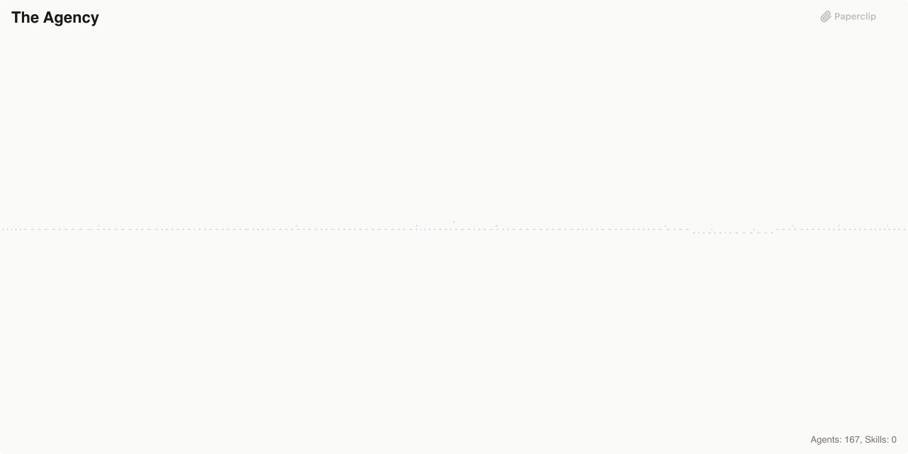
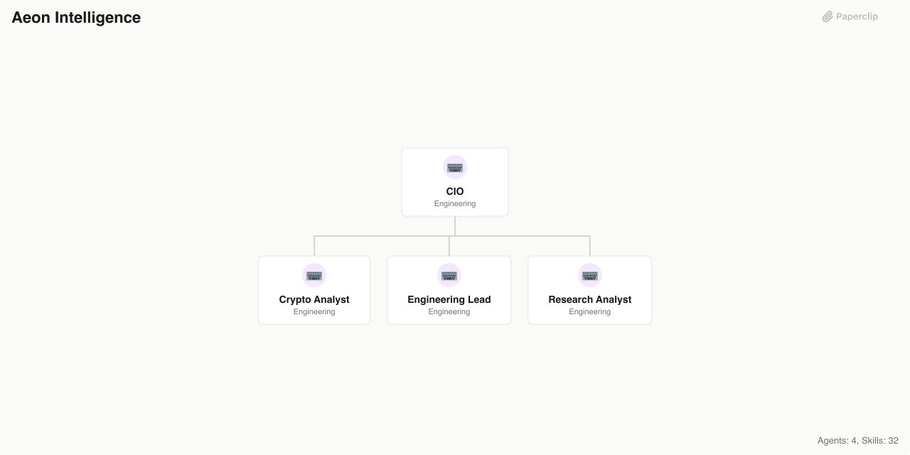
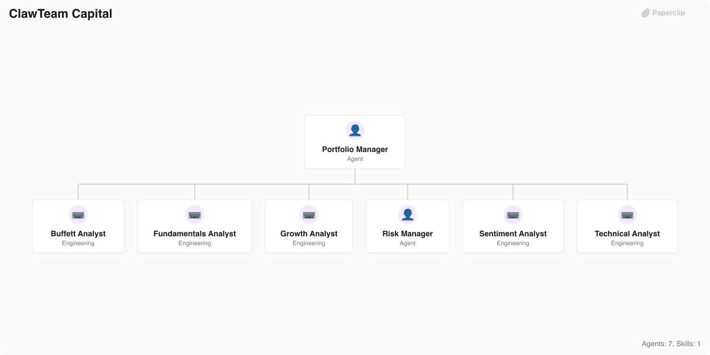
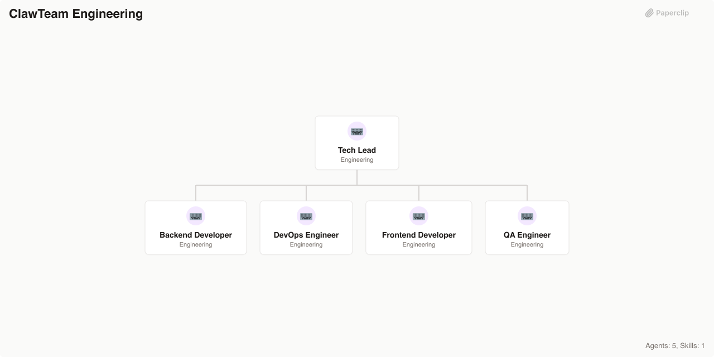
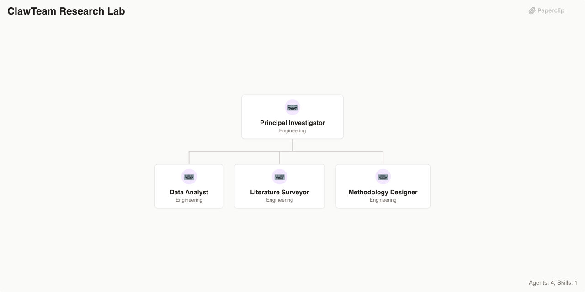
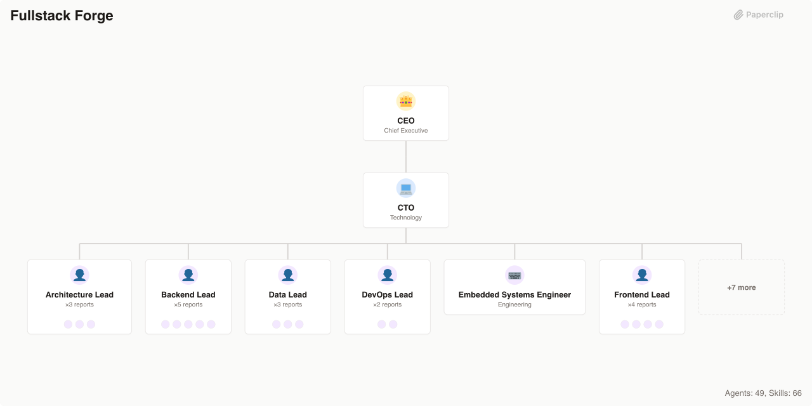
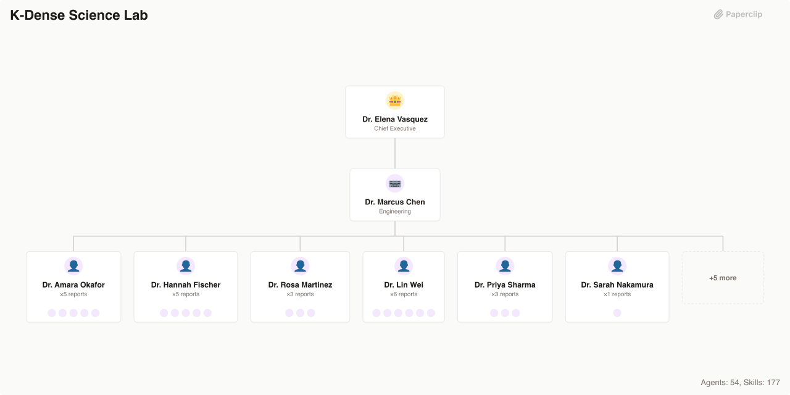
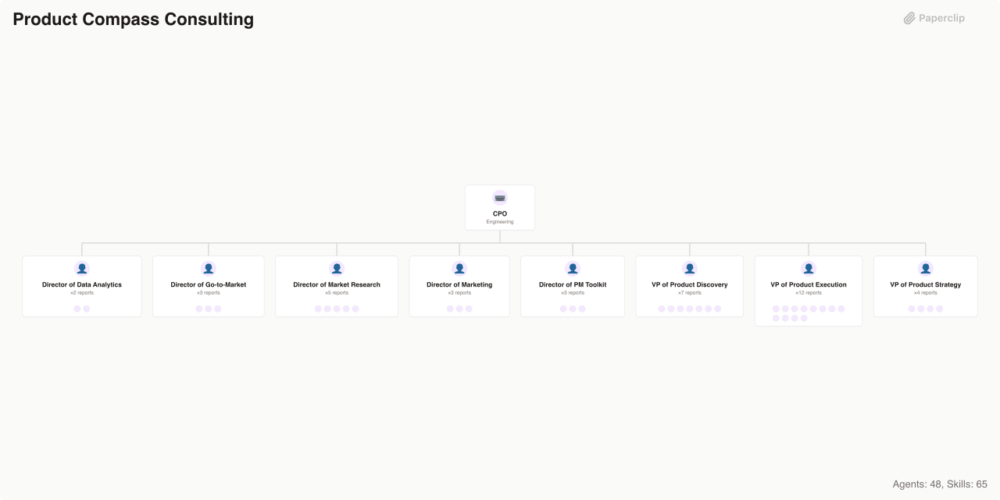
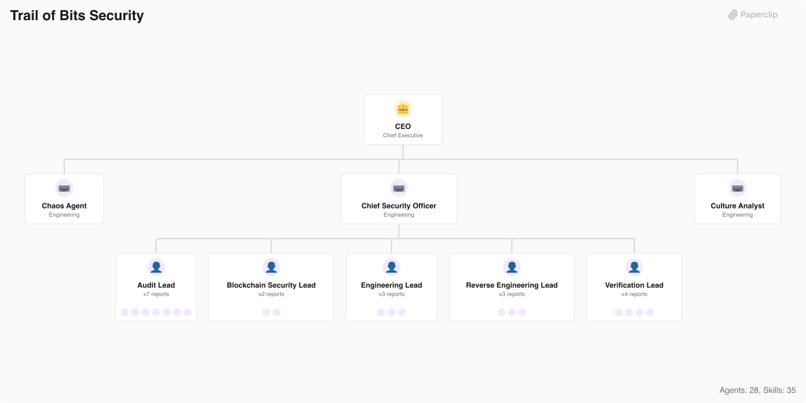

# 🏢 Paperclip Companies

> **Deploy an entire AI workforce in minutes** — 16 pre-built companies, 440+ specialized agents, and 500+ battle-tested skills. From security auditors to game studios, from scientific research labs to full-stack dev shops. Plug in, power up, ship.

[](https://github.com/paperclipai/companies)
[](https://opensource.org/licenses/MIT)
[](https://makeapullrequest.com)
[](https://github.com/paperclipai/paperclip)

---

## 🚀 What Is This?

A growing catalog of ready-to-deploy agent companies for the [Paperclip](https://github.com/paperclipai/paperclip) platform. Each company is a fully configured team of AI agents — org chart, skills, governance — that you can import and run immediately.

- **🎯 Domain-Specific**: Security firms, game studios, science labs, consultancies — not generic prompt wrappers
- **🧬 Complete Org Structures**: CEO → directors → specialists, with real reporting lines and delegation
- **🛠️ Skill-Loaded**: Hundreds of reusable workflow skills agents actually know how to run
- **⚡ Import & Go**: `paperclipai company import --from ./trail-of-bits-security` and you're live

| Company | Agents | Skills | Source |
|---------|--------|--------|--------|
| [GStack](#gstack) | 5 | 8 | [gstack](https://github.com/garrytan/gstack/tree/main) |
| [Superpowers Dev Shop](#superpowers-dev-shop) | 4 | 14 | [superpowers](https://github.com/obra/superpowers) |
| [Agency Agents](#agency-agents) | 167 | — | [agency-agents](https://github.com/msitarzewski/agency-agents) |
| [Aeon Intelligence](#aeon-intelligence) | 4 | 32 | [Aeon](https://github.com/aaronjmars/aeon) |
| [AgentSys Engineering](#agentsys-engineering) | 5 | 14 | [agentsys](https://github.com/agent-sh/agentsys) |
| [ClawTeam Capital](#clawteam-capital) | 7 | 1 | [ClawTeam](https://github.com/HKUDS/ClawTeam) |
| [ClawTeam Engineering](#clawteam-engineering) | 5 | 1 | [ClawTeam](https://github.com/HKUDS/ClawTeam) |
| [ClawTeam Research Lab](#clawteam-research-lab) | 4 | 1 | [ClawTeam](https://github.com/HKUDS/ClawTeam) |
| [Donchitos Game Studio](#donchitos-game-studio) | 48 | 38 | [Claude-Code-Game-Studios](https://github.com/Donchitos/Claude-Code-Game-Studios) |
| [Fullstack Forge](#fullstack-forge) | 49 | 66 | [claude-skills](https://github.com/jeffallan/claude-skills) |
| [K-Dense Science Lab](#k-dense-science-lab) | 54 | 177 | [claude-scientific-skills](https://github.com/K-Dense-AI/claude-scientific-skills) |
| [MiniMax Studio](#minimax-studio) | 5 | 10 | [MiniMax-AI/skills](https://github.com/MiniMax-AI/skills) |
| [Product Compass Consulting](#product-compass-consulting) | 48 | 65 | [pm-skills](https://github.com/phuryn/pm-skills) |
| [RedOak Review](#redoak-review) | 5 | 6 | [claude-code-workflows](https://github.com/OneRedOak/claude-code-workflows) |
| [TÂCHES Creative](#tâches-creative) | 6 | 35 | [taches-cc-resources](https://github.com/glittercowboy/taches-cc-resources) |
| [Trail of Bits Security](#trail-of-bits-security) | 28 | 35 | [skills](https://github.com/trailofbits/skills) |

## Companies

### [GStack](./gstack)

Engineering company powered by gstack workflow skills — distinct cognitive modes for product vision, technical planning, code review, shipping, and QA. Built from [gstack](https://github.com/garrytan/gstack/tree/main).


**Agents (5):** Ceo, Cto, Qa Engineer, Release Engineer, Staff Engineer

**Skills (8):** browse, plan-ceo-review, plan-eng-review, qa, retro, review, setup-browser-cookies, ship

### [Superpowers Dev Shop](./superpowers)

A disciplined software development company powered by the Superpowers workflow — brainstorm, plan, build with TDD, review, and ship. Built from [superpowers](https://github.com/obra/superpowers).


**Agents (4):** Ceo, Code Reviewer, Lead Engineer, Release Engineer

**Skills (14):** brainstorming, dispatching-parallel-agents, executing-plans, finishing-a-development-branch, receiving-code-review, requesting-code-review, subagent-driven-development, systematic-debugging, test-driven-development, using-git-worktrees, using-superpowers, verification-before-completion, writing-plans, writing-skills

### [Agency Agents](./agency-agents)

A complete AI agency with 167 specialized agents across 10 divisions — engineering, design, marketing, product, sales, QA, operations, game development, spatial computing, and specialized operations. Built from [agency-agents](https://github.com/msitarzewski/agency-agents).



**Agents (167):** Managing Director, VP Engineering, Creative Director, CMO, VP Product, VP Sales, QA Director, VP Operations, Game Dev Director, XR Director, Chief of Staff, and 156 more

### [Aeon Intelligence](./aeon-intelligence)

Autonomous AI intelligence company powered by Aeon — runs research, engineering, crypto monitoring, and productivity workflows on GitHub Actions via Claude Code. Built from [Aeon](https://github.com/aaronjmars/aeon).



**Agents (4):** Cio, Crypto Analyst, Engineering Lead, Research Analyst

**Skills (32):** morning-brief, weekly-review, goal-tracker, digest, idea-capture, heartbeat, memory-flush, reflect, skill-health, self-review, article, research-brief, paper-digest, hacker-news-digest, rss-digest, reddit-digest, security-digest, tweet-digest, fetch-tweets, search-papers, pr-review, github-monitor, issue-triage, changelog, code-health, feature, build-skill, search-skill, token-alert, wallet-digest, on-chain-monitor, defi-monitor

### [AgentSys Engineering](./agentsys-engineering)

AI-powered software engineering company that orchestrates the full development lifecycle — from task discovery through production shipping. Built from [agentsys](https://github.com/agent-sh/agentsys).


**Agents (5):** Ceo, Cto, Qa Release Lead, Research Perf Analyst, Staff Engineer

**Skills (14):** consult, debate, deslop, discover-tasks, drift-analysis, enhance-orchestrator, enhance-prompts, learn, orchestrate-review, perf-analyzer, perf-benchmarker, repo-intel, sync-docs, validate-delivery

### [ClawTeam Capital](./clawteam-capital)

AI-powered investment analysis through specialized multi-agent teams that research securities from multiple angles and consolidate signals into risk-adjusted portfolio decisions. Built from [ClawTeam](https://github.com/HKUDS/ClawTeam).



**Agents (7):** Buffett Analyst, Fundamentals Analyst, Growth Analyst, Portfolio Manager, Risk Manager, Sentiment Analyst, Technical Analyst

**Skills (1):** clawteam

### [ClawTeam Engineering](./clawteam-engineering)

Agentic software engineering through self-organizing multi-agent teams that plan, build, review, test, and deploy software autonomously. Built from [ClawTeam](https://github.com/HKUDS/ClawTeam).



**Agents (5):** Backend Developer, Devops Engineer, Frontend Developer, Qa Engineer, Tech Lead

**Skills (1):** clawteam

### [ClawTeam Research Lab](./clawteam-research-lab)

Autonomous ML research automation through coordinated multi-agent teams that conduct literature surveys, design experiments, run analyses, and synthesize findings. Built from [ClawTeam](https://github.com/HKUDS/ClawTeam).



**Agents (4):** Data Analyst, Literature Surveyor, Methodology Designer, Principal Investigator

**Skills (1):** clawteam

### [Donchitos Game Studio](./donchitos-game-studio)

Full-service indie game development studio with 48 coordinated AI agents spanning creative direction, engineering, design, art, audio, narrative, QA, and production. Built from [Claude-Code-Game-Studios](https://github.com/Donchitos/Claude-Code-Game-Studios).


**Agents (48):** Accessibility Specialist, Ai Programmer, Analytics Engineer, Art Director, Audio Director, Community Manager, Creative Director, Devops Engineer, Economy Designer, Engine Programmer, Game Designer, Gameplay Programmer, and 36 more

**Skills (38):** architecture-decision, asset-audit, balance-check, brainstorm, bug-report, changelog, code-review, design-review, design-system, estimate, gate-check, hotfix, launch-checklist, localize, map-systems, milestone-review, onboard, patch-notes, perf-profile, playtest-report, project-stage-detect, prototype, release-checklist, retrospective, reverse-document, scope-check, setup-engine, sprint-plan, start, team-audio, team-combat, team-level, team-narrative, team-polish, team-release, team-ui, tech-debt

### [Fullstack Forge](./fullstack-forge)

A full-service software development consultancy with 66 specialized skills covering 12 programming languages, 7 backend frameworks, frontend/mobile, infrastructure, security, data science, and DevOps. Built from [claude-skills](https://github.com/jeffallan/claude-skills).



**Agents (49):** Ai Engineer, Angular Engineer, Api Engineer, Architecture Lead, Atlassian Engineer, Backend Lead, Ceo, Cloud Engineer, Code Quality Specialist, Cto, Data Engineer, Data Lead, and 37 more

**Skills (66):** angular-architect, api-designer, architecture-designer, atlassian-mcp, chaos-engineer, cli-developer, cloud-architect, code-documenter, code-reviewer, cpp-pro, csharp-developer, database-optimizer, debugging-wizard, devops-engineer, django-expert, dotnet-core-expert, embedded-systems, fastapi-expert, feature-forge, fine-tuning-expert, flutter-expert, fullstack-guardian, game-developer, golang-pro, graphql-architect, java-architect, javascript-pro, kotlin-specialist, kubernetes-specialist, laravel-specialist, legacy-modernizer, mcp-developer, microservices-architect, ml-pipeline, monitoring-expert, nestjs-expert, nextjs-developer, pandas-pro, php-pro, playwright-expert, postgres-pro, prompt-engineer, python-pro, rag-architect, rails-expert, react-expert, react-native-expert, rust-engineer, salesforce-developer, secure-code-guardian, security-reviewer, shopify-expert, spark-engineer, spec-miner, spring-boot-engineer, sql-pro, sre-engineer, swift-expert, terraform-engineer, test-master, the-fool, typescript-pro, vue-expert, vue-expert-js, websocket-engineer, wordpress-pro

### [K-Dense Science Lab](./kdense-science-lab)

A multi-disciplinary scientific research institute powered by 177 specialized skills spanning bioinformatics, drug discovery, clinical research, machine learning, quantum computing, and 37 scientific databases. Built from [claude-scientific-skills](https://github.com/K-Dense-AI/claude-scientific-skills).



**Agents (54):** Bio Genomics Lead, Biochemistry Specialist, Biomedical Db Specialist, Ceo, Cheminformatics Scientist, Chemistry Db Specialist, Chief Science Officer, Clinical Data Scientist, Clinical Research Lead, Clinical Trials Specialist, Computational Physicist, Critical Analysis Specialist, and 42 more

**Skills (177):** adaptyv, aeon, alpha-vantage, alphafold-database, anndata, arboreto, arxiv-database, astropy, benchling-integration, bgpt-paper-search, bindingdb-database, biopython, biorxiv-database, bioservices, brenda-database, cbioportal-database, cellxgene-census, chembl-database, cirq, citation-management, clinical-decision-support, clinical-reports, clinicaltrials-database, clinpgx-database, clinvar-database, cobrapy, consciousness-council, cosmic-database, dask, datacommons-client, datamol, deepchem, deeptools, denario, depmap, dhdna-profiler, diffdock, dnanexus-integration, docx, drugbank-database, edgartools, ena-database, ensembl-database, esm, etetoolkit, exploratory-data-analysis, fda-database, flowio, fluidsim, fred-economic-data, and 127 more

### [MiniMax Studio](./minimax-studio)

Full-service digital studio that builds apps, creates visual effects, and produces professional documents. Built from [MiniMax-AI/skills](https://github.com/MiniMax-AI/skills).


**Agents (5):** App Engineer, Ceo, Document Producer, Graphics Engineer, Mobile Engineer

**Skills (10):** android-native-dev, frontend-dev, fullstack-dev, gif-sticker-maker, ios-application-dev, minimax-docx, minimax-pdf, minimax-xlsx, pptx-generator, shader-dev

### [Product Compass Consulting](./product-compass-consulting)

Full-service AI product management consultancy with 65 specialized skills covering discovery, strategy, execution, research, analytics, go-to-market, marketing, and PM career tools. Built from [pm-skills](https://github.com/phuryn/pm-skills).



**Agents (48):** Assumption Analyst, Battlecard Writer, Brand Specialist, Business Model Analyst, Career Specialist, Competitive Analyst, Competitive Intel Analyst, Cpo, Data Generator, Director Data Analytics, Director Gtm, Director Market Research, and 36 more

**Skills (65):** ab-test-analysis, analyze-feature-requests, ansoff-matrix, beachhead-segment, brainstorm-experiments-existing, brainstorm-experiments-new, brainstorm-ideas-existing, brainstorm-ideas-new, brainstorm-okrs, business-model, cohort-analysis, competitive-battlecard, competitor-analysis, create-prd, customer-journey-map, draft-nda, dummy-dataset, grammar-check, growth-loops, gtm-motions, gtm-strategy, ideal-customer-profile, identify-assumptions-existing, identify-assumptions-new, interview-script, job-stories, lean-canvas, market-segments, market-sizing, marketing-ideas, metrics-dashboard, monetization-strategy, north-star-metric, opportunity-solution-tree, outcome-roadmap, pestle-analysis, porters-five-forces, positioning-ideas, pre-mortem, pricing-strategy, prioritization-frameworks, prioritize-assumptions, prioritize-features, privacy-policy, product-name, product-strategy, product-vision, release-notes, retro, review-resume, sentiment-analysis, sprint-plan, sql-queries, stakeholder-map, startup-canvas, summarize-interview, summarize-meeting, swot-analysis, test-scenarios, user-personas, user-segmentation, user-stories, value-prop-statements, value-proposition, wwas

### [RedOak Review](./redoak-review)

A boutique code quality, design, and security review agency powered by pragmatic, opinionated review workflows. Built from [claude-code-workflows](https://github.com/OneRedOak/claude-code-workflows).


**Agents (5):** Ceo, Ci Integration Engineer, Code Reviewer, Design Reviewer, Security Reviewer

**Skills (6):** code-review-action, design-review, design-review-action, pragmatic-code-review, security-review, security-review-action

### [TÂCHES Creative](./taches-creative)

A creative strategy and meta-skills agency specializing in thinking frameworks, research methodology, and AI workflow optimization. Built from [taches-cc-resources](https://github.com/glittercowboy/taches-cc-resources).


**Agents (6):** Ceo, Quality Auditor, Research Lead, Skills Architect, Strategy Director, Workflow Designer

**Skills (35):** consider-10-10-10, consider-5-whys, consider-eisenhower-matrix, consider-first-principles, consider-inversion, consider-occams-razor, consider-one-thing, consider-opportunity-cost, consider-pareto, consider-second-order, consider-swot, consider-via-negativa, context-handoff, create-agent-skills, create-hooks, create-mcp-servers, create-meta-prompts, create-plans, create-slash-commands, create-subagents, debug-like-expert, iphone-apps-expertise, macos-apps-expertise, meta-prompting, n8n-automations-expertise, research-competitive, research-deep-dive, research-feasibility, research-history, research-landscape, research-open-source, research-options, research-technical, setup-ralph, todo-management

### [Trail of Bits Security](./trail-of-bits-security)

A prestigious security auditing and verification firm with expertise in smart contract security, cryptographic analysis, binary reverse engineering, and application security testing. Built from [skills](https://github.com/trailofbits/skills).



**Agents (28):** Audit Lead, Binary Analyst, Blockchain Security Lead, Burpsuite Analyst, Ceo, Chaos Agent, Chief Security Officer, Code Auditor, Constant Time Analyst, Contract Entry Point Analyst, Culture Analyst, Engineering Lead, and 16 more

**Skills (35):** agentic-actions-auditor, ask-questions-if-underspecified, audit-context-building, building-secure-contracts, burpsuite-project-parser, claude-in-chrome-troubleshooting, constant-time-analysis, culture-index, debug-buttercup, devcontainer-setup, differential-review, dwarf-expert, entry-point-analyzer, firebase-apk-scanner, fp-check, gh-cli, git-cleanup, insecure-defaults, let-fate-decide, modern-python, property-based-testing, seatbelt-sandboxer, second-opinion, semgrep-rule-creator, semgrep-rule-variant-creator, sharp-edges, skill-improver, spec-to-code-compliance, static-analysis, supply-chain-risk-auditor, testing-handbook-skills, variant-analysis, workflow-skill-design, yara-authoring, zeroize-audit

### [Default](./default)

Baseline agent configurations (CEO, default roles) used as the starting point when creating new companies.

## Structure

Each company directory contains:

- `COMPANY.md` — company metadata, description, and goals
- `agents/` — agent configurations with role-specific prompts
- `skills/` — workflow skills available to agents
- `README.md` — detailed company documentation
- `.paperclip.yaml` — Paperclip configuration

The repo also includes top-level shared skills:

- `skills/company-creator` — scaffolds new agent company packages that follow the Agent Companies spec
- `.agents/skills/company-creator` — compatibility symlink for agents that discover skills from `.agents/skills`

## Shared Skills

### `company-creator`

Use `company-creator` when you want an agent to create a new company package from scratch, turn an existing repo into a company, or scaffold a team around an existing workflow.

Canonical path: `skills/company-creator/SKILL.md`

Compatibility path for agent skill discovery: `.agents/skills/company-creator`

## Usage

These companies are managed by the Paperclip platform. See the [Paperclip docs](https://github.com/paperclipai/paperclip) for setup and deployment.

To use the shared `company-creator` skill with an agent:

```text
Use the company-creator skill to create a new company for a product design team.
```

```text
Use the company-creator skill to turn this repo into a Paperclip company package.
```

The skill will interview you, scaffold the company package, and write the output where you choose.

To import a generated company into Paperclip:

```bash
paperclipai company import --from /path/to/company
```
